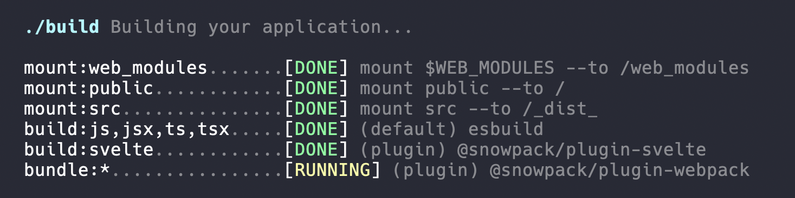

`snowpack build` - When you're ready to deploy your application, run the build command to generate a static production build of your site. Building is tightly integrated with your dev setup so that you are guaranteed to get a near-exact copy of the same code that you saw during development.

`snowpack build` - 当你准备布署你的应用时，运行 build 命令来给你的网站生成一个静态生产构建。构建与你的 dev 设置紧密集成，以确保你得到一份副本与你在开发时看到的代码几乎相同。

### Bundle for Production

### 应用打包

**You should be able to use a bundler because you want to, and not because you need to.** That was the original concept that Snowpack was designed to address. Snowpack treats bundling as an optional production optimization, which means you're free to skip over the extra complexity of bundling until you need it.

**你应该可以使用打包器，因为你想用，而不是需要用。**这是 Snowpack 旨在解决的原始概念。Snowpack 将构建看作可选的生产优化，这意味着你随意跳过打包的额外复杂性，直到你需要它为止。

By default, `snowpack build` will build your site using the same unbundled approach as the `dev` command. This is fine for most projects, but you also may still want to bundle for production. Legacy browser support, code minification, code-splitting, tree-shaking, dead code elimination, and other performance optimizations can all be handled in Snowpack via bundling.

`snowpack build` 默认会使用与 `dev` 命令相同的非打包方式来构建你的网站。这对大多数项目来说已经可以了，但你也可能仍想打包你的应用。旧浏览器支持、代码压缩、代码分割、删除未引用代码（tree-shaking）、死代码消除以及其它性能优化都可以在 Snowpack 中通过打包来处理。

Bundlers normally require dozens or even hundreds of lines of configuration, but with Snowpack it's just a one-line plugin with no config required. This is possible because Snowpack builds your application _before_ sending it to the bundler, so the bundler never sees your custom source code (JSX, TS, Svelte, Vue, etc.) and instead needs to worry only about building common HTML, CSS, and JS.

打包器通常需要几十甚至上百行的配置，而在 Snowpack 中只需要一行无需配置的插件。这是有可能的，因为 Snowpack 在构建你的应用 _之前_ 把它发给打包器，所以打包器永远不会看到你的自定义源代码（JSX、TS、Svelte、Vue 等等）而仅需关心常规的 HTML、CSS 和 JS。

```js
// 打包器插件已预先配置为可以与 Snowpack 应用一起使用
// 无需配置！
{
  "plugins": [["@snowpack/plugin-webpack"]]
}
```

See [our bundling guides](/guides/optimize-and-bundle) for more information about connecting bundled (or unbundled) optimization plugins for your production builds.

更多关于使用打包式（或非打包式）优化插件构建应用的信息，请查看[我们的打包指南](/guides/optimize-and-bundle)。

## Legacy Browser Support

## 传统浏览器支持

You can customize the set of browsers you'd like to support via the `package.json` "browserslist" property, going all the way back to IE11. This will be picked up when you run `snowpack build` to build for production.

你可以通过 `package.json` 的 browserlist 属性来自定义想要支持的浏览器集合，甚至包括 IE11。这会在你运行 `snowpack build` 以构建应用时使用。

```js
/* package.json */
"browserslist": ">0.75%, not ie 11, not UCAndroid >0, not OperaMini all",
```

If you're worried about legacy browsers, you should also add a bundler to your production build. Check out our [section on bundling for deployment](/guides/optimize-and-bundle) for more info.

如果你担心传统浏览器，你应该在应用的构建中再加一个打包器。更多信息请查看我们的[打包布署章节](/guides/optimize-and-bundle)。

Note: During development (`snowpack dev`) we perform no transpilation for older browsers. Make sure that you're using a modern browser during development.

注意：在开发过程中（`snowpack dev`）我们不会为旧浏览器做转译。确保你在开发过程中使用的是一个现代的浏览器。
